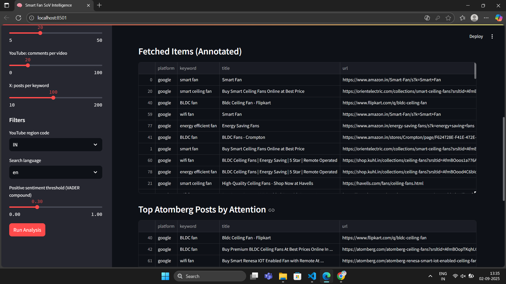
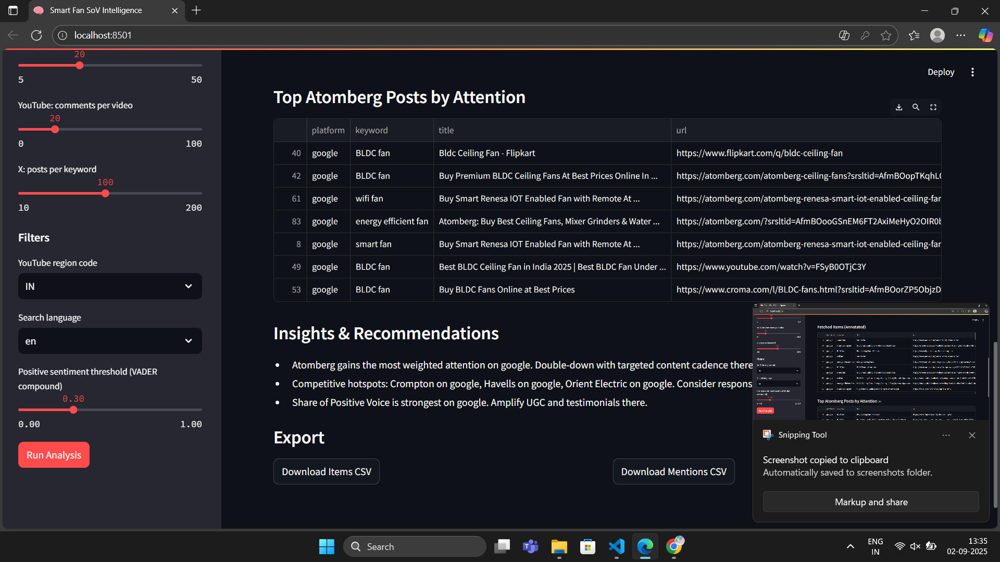
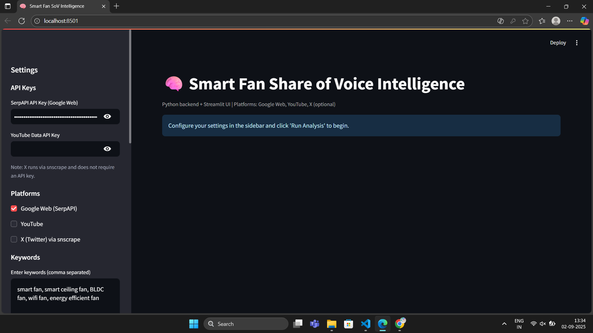
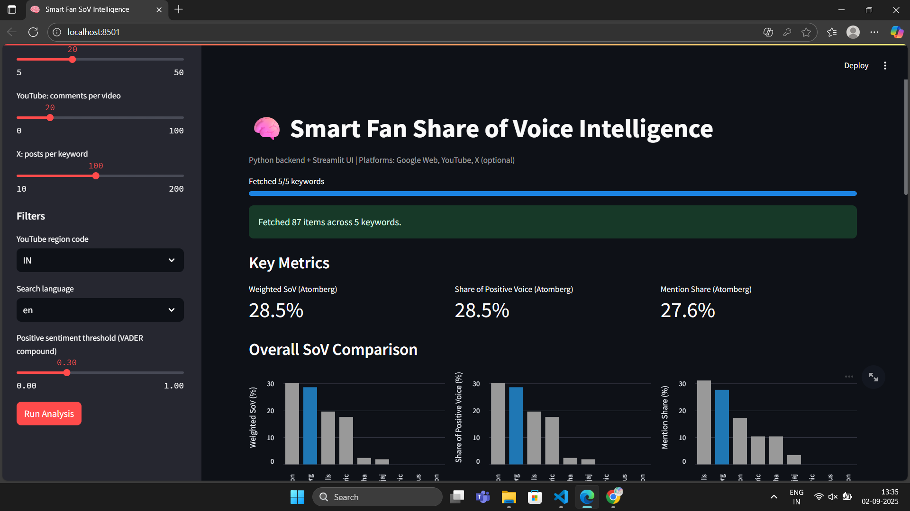

# Share of Voice (SoV) Agent — Smart Fan

I built a small AI agent that measures Share of Voice for “smart fan” and related keywords across the web. It searches platforms, collects mentions and engagement, runs sentiment analysis, and gives a clean SoV breakdown for Atomberg vs competitors—plus insights and recommendations for our content/marketing team.

## Why this and what “N” I chose
- Platforms: I start with Google Search and YouTube because they have reliable public data and meaningful engagement signals. X (Twitter) is optional via snscrape. Instagram can be added later with proper access.
- Top N results: default N = 20 per platform. Rationale:
  - Diminishing returns after top 20 (matches typical CTR curves).
  - Keeps API cost/latency manageable while still being representative.
  - You can change N in the UI if you need more/less coverage.

## What SoV means here
I compute SoV in three complementary ways so we don’t overfit to any one metric:
1) Unweighted Mention Share
   - Simply: brand mentions divided by total mentions across results.
2) Attention-Weighted SoV
   - Google: weight by a standard CTR-by-position curve (top ranks matter more).
   - YouTube: weight by log-scaled engagement (views, likes, comments).
   - X (optional): weight by log-scaled likes + retweets/replies.
3) Share of Positive Voice (sentiment-aware)
   - Only positive mentions (compound sentiment > 0.3) are included and weighted as above.

These three together give a robust view: who’s talked about, who’s capturing attention, and who’s loved.

## Brands and keywords
- Default brands: Atomberg plus peers (e.g., Havells, Crompton, Orient, Bajaj, Usha). You can edit this list in the UI—including spelling variants like “Atom berg”, “Atom-berg”.
- Default keywords: 
  - “smart fan”
  - “smart ceiling fan”
  - “BLDC fan”
  - “wifi fan”
  - “energy efficient fan”
  You can add/remove keywords in the UI and run a multi-keyword analysis.

## How it works (high-level)
- Google (via SerpAPI): fetch top results, parse titles/snippets, count mentions by brand, apply a CTR weight by rank.
- YouTube (YouTube Data API v3): search + fetch engagement stats (views/likes/comments), parse titles/desc, apply log-scaled weights.
- X (optional, via snscrape): search posts, parse text, collect engagement (likes/retweets/replies), apply log-scaled weights.
- Sentiment: VADER (lexicon-based) to score positive/neutral/negative; “positive voice” is compound > 0.3.
- Aggregation: calculate SoV per keyword, per platform, and overall. Export to CSV if needed.

## Tech stack
- Python + Streamlit for the UI.
- SerpAPI for Google Web results.
- YouTube Data API v3.
- snscrape (optional) for X.
- VADER sentiment (from NLTK or vaderSentiment package).
- Pandas for data wrangling.
- Caching to keep things responsive.

## Project layout
- scripts/app.py — Streamlit UI (sidebar controls, run analysis, tables/charts, exports)
- scripts/connectors/google_search.py — Google (SerpAPI) search
- scripts/connectors/youtube_search.py — YouTube search + stats
- scripts/connectors/x_search.py — X search (optional, snscrape-based)
- scripts/analysis/sentiment.py — VADER sentiment helpers
- scripts/analysis/sov.py — mention extraction, weighting, SoV math
- scripts/requirements.txt — dependencies

## Setup

Prereqs:
- Python 3.9–3.11 recommended (I usually use 3.10+)
- A virtual environment (recommended)

Install:
- pip install -r scripts/requirements.txt

Run:
- streamlit run scripts/app.py

API keys (quickest path):
- Paste SerpAPI key and YouTube API key in the Streamlit sidebar.
- Alternatively, set environment variables SERPAPI_API_KEY and YOUTUBE_API_KEY before running the app.

## Using the app
1) Open the sidebar in Streamlit.
2) Choose platforms (Google, YouTube, optional X), set N (default 20).
3) Enter keywords and brands (also add brand aliases/variants).
4) Click “Run Analysis”.
5) Review:
   - Unweighted Mention Share
   - Attention-Weighted SoV
   - Share of Positive Voice
   - Per-platform tables and charts
6) Export CSVs for reporting.

## Interpreting the metrics
- If Atomberg leads in Unweighted Mentions but lags in Attention-Weighted SoV, we’re present but not capturing engagement—optimize titles/thumbnails/descriptions (esp. YouTube).
- If Share of Positive Voice is lower than a competitor, prioritize content formats and creators that drive positive sentiment (reviews, explainers, energy savings stories).
- Cross-keyword differences highlight where to invest (e.g., “BLDC fan” vs “smart ceiling fan”).

## Recommendations output (examples)
- Content: Double down on explainer videos for “BLDC fan” and “energy efficient fan” where engagement is strong and sentiment is positive.
- SEO: Optimize for “smart ceiling fan” product pages where CTR-weighted SoV shows competitors outperforming at top ranks.
- Social: Amplify creator partnerships that historically drive positive sentiment when mentioning Atomberg.

## Troubleshooting

Numpy version conflict (thinc / spaCy environments):
- If you see something like “thinc requires numpy<2.0.0 but you have numpy 2.x”, I pin numpy to 1.26.4 in requirements to avoid this.
- Fix by reinstalling deps:
  - pip install --upgrade --force-reinstall -r scripts/requirements.txt

Quota or auth issues:
- Google/YouTube returning errors often means missing/invalid API keys or rate limits. Try reducing N or waiting, or use fewer platforms.

No results for X:
- snscrape can be rate-limited. If it fails, disable X and re-run Google/YouTube.

## Notes and limitations
- Public data only; accuracy depends on what platforms expose.
- Sentiment via lexicon has edge cases; it’s used directionally. Future step: fine-tuned model on domain data.
- Instagram not included by default due to access friction; can be added with the right API setup.

## Roadmap (nice-to-haves)
- Add Instagram with official APIs or partner tools.
- Comment-level mining on YouTube for deeper sentiment.
- Creator/Channel-level insights and watch-time weighting.
- Automated weekly reports with deltas and alerts.

## Why this is useful
This gives me an always-on, comparable way to see how much “share of attention” Atomberg wins on “smart fan” and related intents—plus whether that attention is positive. It turns vague “buzz” into numbers I can act on quickly.

## Here is how the app looks:

